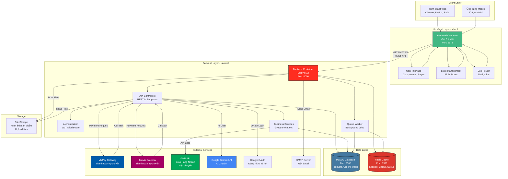
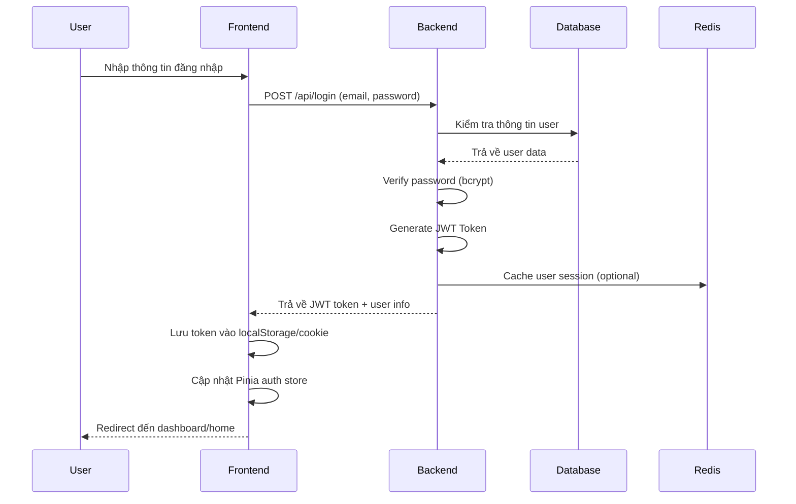
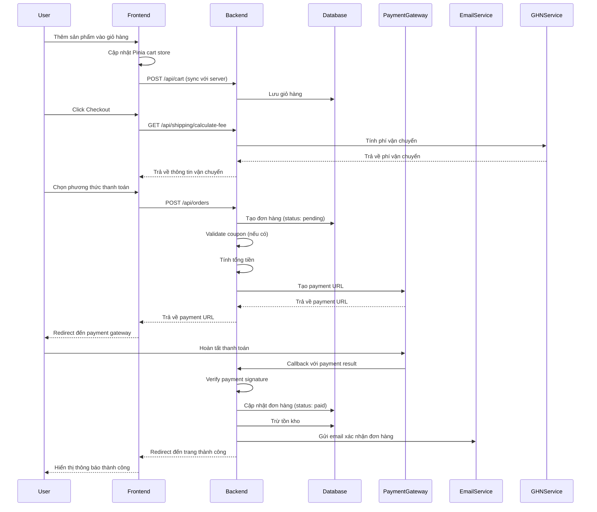
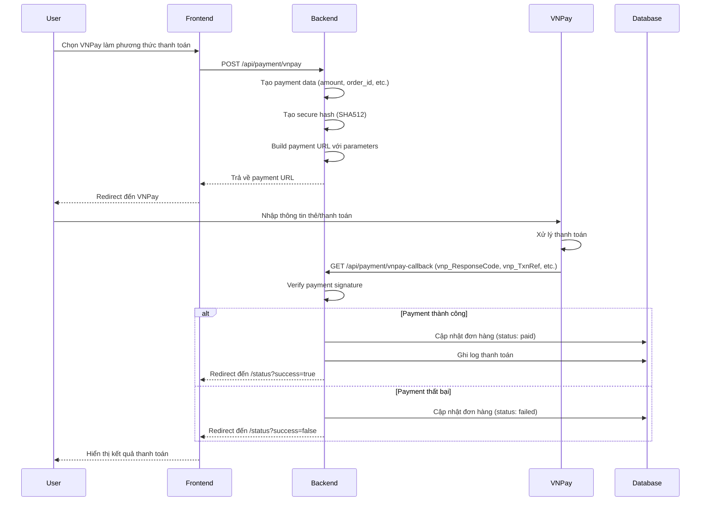
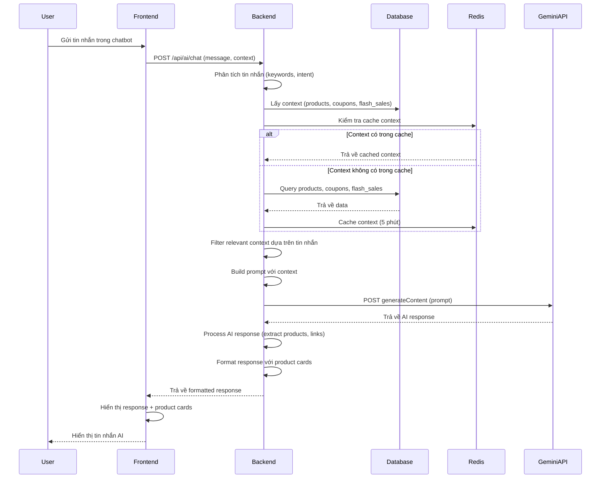
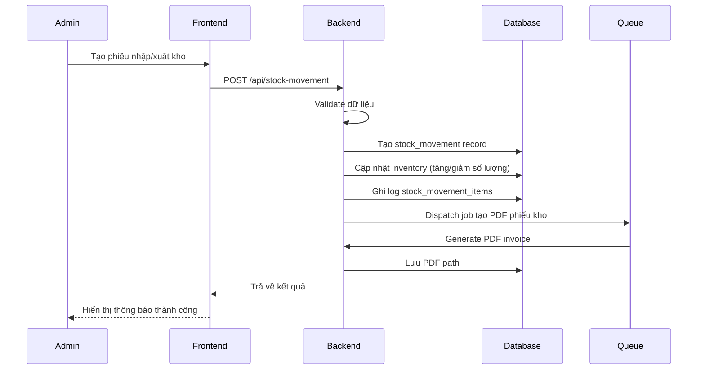
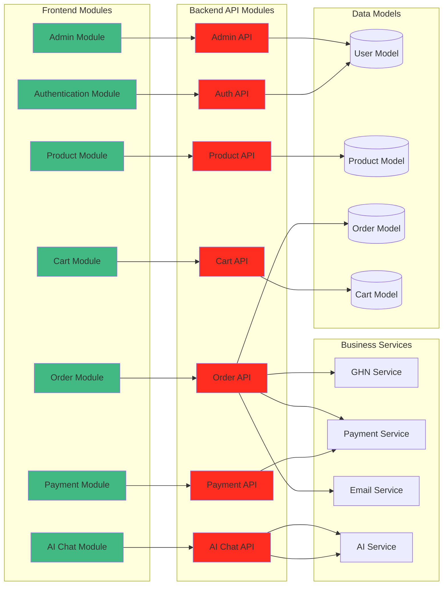

# BÁO CÁO ĐỒ ÁN TỐT NGHIỆP

## HỆ THỐNG WEBSITE THƯƠNG MẠI ĐIỆN TỬ BÁN HÀNG THỜI TRANG

---

**Sinh viên thực hiện:** [Tên sinh viên]  
**Mã sinh viên:** [Mã sinh viên]  
**Lớp:** [Lớp]  
**Giảng viên hướng dẫn:** [Tên giảng viên]  
**Năm học:** 2024 - 2025

---

## MỤC LỤC

1. [MỞ ĐẦU](#1-mở-đầu)
2. [TỔNG QUAN VỀ ĐỀ TÀI](#2-tổng-quan-về-đề-tài)
3. [PHÂN TÍCH YÊU CẦU HỆ THỐNG](#3-phân-tích-yêu-cầu-hệ-thống)
4. [THIẾT KẾ HỆ THỐNG](#4-thiết-kế-hệ-thống)
5. [CÔNG NGHỆ VÀ CÔNG CỤ SỬ DỤNG](#5-công-nghệ-và-công-cụ-sử-dụng)
6. [PHÂN TÍCH VÀ THIẾT KẾ CƠ SỞ DỮ LIỆU](#6-phân-tích-và-thiết-kế-cơ-sở-dữ-liệu)
7. [THỰC THI HỆ THỐNG](#7-thực-thi-hệ-thống)
8. [KIỂM THỬ VÀ ĐÁNH GIÁ](#8-kiểm-thử-và-đánh-giá)
9. [KẾT QUẢ ĐẠT ĐƯỢC](#9-kết-quả-đạt-được)
10. [KẾT LUẬN VÀ HƯỚNG PHÁT TRIỂN](#10-kết-luận-và-hướng-phát-triển)

---

## 1. MỞ ĐẦU

### 1.1. Lý do chọn đề tài

Trong bối cảnh công nghệ thông tin phát triển mạnh mẽ, thương mại điện tử (E-commerce) đã trở thành xu hướng tất yếu của nền kinh tế số. Đặc biệt, ngành thời trang là một trong những lĩnh vực có tốc độ tăng trưởng nhanh nhất trong thương mại điện tử.

Việc xây dựng một hệ thống website thương mại điện tử bán hàng thời trang không chỉ đáp ứng nhu cầu thực tế của thị trường mà còn là cơ hội để áp dụng các kiến thức đã học vào thực tế, bao gồm:

- Phát triển ứng dụng web hiện đại với kiến trúc tách biệt Frontend và Backend
- Áp dụng các công nghệ mới nhất trong phát triển web
- Xây dựng hệ thống quản lý phức tạp với nhiều module chức năng
- Tích hợp các dịch vụ thanh toán trực tuyến
- Ứng dụng trí tuệ nhân tạo (AI) trong hỗ trợ khách hàng

### 1.2. Mục tiêu nghiên cứu

**Mục tiêu chính:**
- Xây dựng một hệ thống website thương mại điện tử hoàn chỉnh cho việc bán hàng thời trang
- Ứng dụng các công nghệ web hiện đại: Laravel, Vue.js, JWT Authentication
- Tích hợp các tính năng thanh toán trực tuyến (VNPay, MoMo)
- Xây dựng hệ thống quản trị với đầy đủ chức năng quản lý

**Mục tiêu cụ thể:**
1. Phát triển Backend API với Laravel 10.x
2. Xây dựng Frontend với Vue 3 và Composition API
3. Thiết kế và triển khai cơ sở dữ liệu MySQL
4. Tích hợp hệ thống xác thực JWT
5. Xây dựng hệ thống quản lý sản phẩm, đơn hàng, người dùng
6. Tích hợp thanh toán trực tuyến
7. Phát triển chatbot AI hỗ trợ khách hàng
8. Xây dựng hệ thống thống kê và báo cáo

### 1.3. Phạm vi nghiên cứu

**Phạm vi chức năng:**
- Quản lý sản phẩm (thêm, sửa, xóa, tìm kiếm, lọc)
- Quản lý đơn hàng (tạo, theo dõi, cập nhật trạng thái)
- Quản lý người dùng và phân quyền
- Hệ thống giỏ hàng và thanh toán
- Quản lý kho hàng và tồn kho
- Hệ thống đánh giá và bình luận sản phẩm
- Quản lý mã giảm giá và flash sale
- Hệ thống tin tức/blog
- Chatbot AI hỗ trợ khách hàng
- Thống kê và báo cáo

**Phạm vi kỹ thuật:**
- Backend: Laravel 10.x (PHP 8.2+)
- Frontend: Vue 3, Composition API, Pinia, Vue Router
- Database: MySQL 5.7+
- Authentication: JWT (JSON Web Token)
- Payment: VNPay, MoMo
- AI: Google Gemini API

### 1.4. Phương pháp nghiên cứu

- **Nghiên cứu lý thuyết:** Tìm hiểu các công nghệ, framework, và best practices
- **Phân tích yêu cầu:** Phân tích nhu cầu thực tế của hệ thống thương mại điện tử
- **Thiết kế hệ thống:** Thiết kế kiến trúc, database, và các module chức năng
- **Phát triển:** Áp dụng phương pháp phát triển phần mềm linh hoạt (Agile)
- **Kiểm thử:** Kiểm thử từng module và tích hợp toàn hệ thống

---

## 2. TỔNG QUAN VỀ ĐỀ TÀI

### 2.1. Tổng quan về thương mại điện tử

Thương mại điện tử (E-commerce) là việc mua bán hàng hóa và dịch vụ thông qua Internet. Với sự phát triển của công nghệ, thương mại điện tử đã trở thành một phần không thể thiếu trong cuộc sống hiện đại.

**Ưu điểm của thương mại điện tử:**
- Tiện lợi: Khách hàng có thể mua sắm mọi lúc, mọi nơi
- Đa dạng: Nhiều sản phẩm và dịch vụ được cung cấp
- Giá cả cạnh tranh: Dễ dàng so sánh giá giữa các cửa hàng
- Tiết kiệm thời gian: Không cần di chuyển đến cửa hàng vật lý
- Thông tin đầy đủ: Dễ dàng tìm hiểu thông tin sản phẩm

### 2.2. Tổng quan về ngành thời trang trực tuyến

Ngành thời trang trực tuyến là một trong những lĩnh vực phát triển nhanh nhất trong thương mại điện tử. Theo thống kê, doanh số bán hàng thời trang trực tuyến tăng trưởng đều đặn hàng năm.

**Đặc điểm của thương mại điện tử thời trang:**
- Sản phẩm đa dạng về mẫu mã, kích thước, màu sắc
- Cần hệ thống quản lý biến thể sản phẩm (variants) phức tạp
- Yêu cầu hình ảnh sản phẩm chất lượng cao
- Cần hệ thống đánh giá và review để khách hàng tham khảo
- Quản lý tồn kho theo từng biến thể sản phẩm

### 2.3. Các hệ thống tương tự

Hiện nay có nhiều nền tảng thương mại điện tử phổ biến:
- **Shopee, Lazada, Tiki:** Các sàn thương mại điện tử lớn tại Việt Nam
- **Shopify, WooCommerce:** Nền tảng xây dựng cửa hàng trực tuyến
- **Magento, PrestaShop:** Hệ thống mã nguồn mở cho thương mại điện tử

**Điểm khác biệt của đề tài:**
- Tích hợp chatbot AI thông minh hỗ trợ khách hàng
- Hệ thống quản lý kho hàng chi tiết với xuất nhập kho
- Giao diện hiện đại, thân thiện với người dùng
- Tích hợp nhiều phương thức thanh toán

---

## 3. PHÂN TÍCH YÊU CẦU HỆ THỐNG

### 3.1. Yêu cầu chức năng

#### 3.1.1. Yêu cầu cho khách hàng

**Quản lý tài khoản:**
- Đăng ký tài khoản mới
- Đăng nhập/Đăng xuất
- Quên mật khẩu và đặt lại mật khẩu
- Xác thực OTP qua email
- Đăng nhập bằng Google (OAuth)
- Cập nhật thông tin cá nhân
- Quản lý địa chỉ giao hàng

**Duyệt và tìm kiếm sản phẩm:**
- Xem danh sách sản phẩm
- Tìm kiếm sản phẩm theo tên, danh mục, thương hiệu
- Lọc sản phẩm theo: giá, danh mục, thương hiệu, kích thước, màu sắc
- Sắp xếp sản phẩm: giá tăng/giảm, mới nhất, bán chạy nhất
- Xem chi tiết sản phẩm với đầy đủ thông tin
- Xem hình ảnh sản phẩm (gallery)
- Xem các biến thể sản phẩm (màu sắc, kích thước)

**Giỏ hàng và thanh toán:**
- Thêm sản phẩm vào giỏ hàng
- Cập nhật số lượng sản phẩm trong giỏ hàng
- Xóa sản phẩm khỏi giỏ hàng
- Áp dụng mã giảm giá
- Tính toán phí vận chuyển
- Thanh toán trực tuyến (VNPay, MoMo)
- Thanh toán khi nhận hàng (COD)

**Quản lý đơn hàng:**
- Xem lịch sử đơn hàng
- Theo dõi trạng thái đơn hàng
- Tra cứu đơn hàng bằng mã tracking
- Hủy đơn hàng (nếu chưa xử lý)
- Yêu cầu đổi trả hàng
- Đặt lại đơn hàng (reorder)

**Tương tác với sản phẩm:**
- Thêm sản phẩm vào danh sách yêu thích
- Đánh giá và bình luận sản phẩm
- Upload hình ảnh đánh giá
- Xem đánh giá của khách hàng khác

**Khác:**
- Xem tin tức/blog
- Liên hệ với cửa hàng
- Sử dụng chatbot AI để được tư vấn
- Xem flash sale và khuyến mãi
- Quản lý voucher/coupon của mình

#### 3.1.2. Yêu cầu cho quản trị viên

**Quản lý sản phẩm:**
- Thêm, sửa, xóa sản phẩm
- Quản lý hình ảnh sản phẩm
- Quản lý biến thể sản phẩm (variants)
- Import sản phẩm từ file Excel
- Quản lý danh mục sản phẩm
- Quản lý thương hiệu
- Kích hoạt/vô hiệu hóa sản phẩm

**Quản lý đơn hàng:**
- Xem danh sách đơn hàng
- Xem chi tiết đơn hàng
- Cập nhật trạng thái đơn hàng
- Xử lý yêu cầu đổi trả hàng
- In hóa đơn
- Xuất báo cáo đơn hàng

**Quản lý người dùng:**
- Xem danh sách người dùng
- Thêm, sửa, xóa người dùng
- Phân quyền người dùng
- Khóa/mở khóa tài khoản
- Xem thống kê người dùng

**Quản lý kho hàng:**
- Xem tồn kho theo sản phẩm/variant
- Nhập kho
- Xuất kho
- Xem lịch sử xuất nhập kho
- Thống kê xuất nhập kho
- In phiếu xuất nhập kho

**Quản lý khuyến mãi:**
- Tạo và quản lý mã giảm giá (coupon)
- Tạo và quản lý flash sale
- Thiết lập thời gian khuyến mãi
- Xem thống kê hiệu quả khuyến mãi

**Quản lý nội dung:**
- Quản lý tin tức/blog
- Quản lý danh mục blog
- Quản lý trang tĩnh (pages)
- Quản lý bình luận/đánh giá

**Thống kê và báo cáo:**
- Dashboard tổng quan
- Thống kê doanh thu (theo ngày, tháng, năm)
- Thống kê đơn hàng
- Thống kê sản phẩm bán chạy
- Thống kê khách hàng
- Thống kê xuất nhập kho
- Biểu đồ trực quan hóa dữ liệu

**Quản lý hệ thống:**
- Cài đặt hệ thống
- Quản lý liên hệ từ khách hàng
- Quản lý tin nhắn
- Cấu hình thanh toán
- Cấu hình vận chuyển

### 3.2. Yêu cầu phi chức năng

**Hiệu năng:**
- Thời gian phản hồi API < 500ms
- Hỗ trợ đồng thời ít nhất 100 người dùng
- Tối ưu hóa truy vấn database
- Cache dữ liệu thường dùng

**Bảo mật:**
- Mã hóa mật khẩu (bcrypt)
- Xác thực JWT
- Bảo vệ CSRF
- Validate dữ liệu đầu vào
- Phân quyền người dùng

**Khả năng mở rộng:**
- Kiến trúc tách biệt Frontend/Backend
- API RESTful
- Dễ dàng thêm tính năng mới
- Hỗ trợ horizontal scaling

**Giao diện người dùng:**
- Responsive design (mobile, tablet, desktop)
- Giao diện hiện đại, thân thiện
- Tải trang nhanh
- Trải nghiệm người dùng tốt

**Khả năng bảo trì:**
- Code có cấu trúc rõ ràng
- Tài liệu đầy đủ
- Dễ dàng debug và sửa lỗi

---

## 4. THIẾT KẾ HỆ THỐNG

### 4.1. Kiến trúc tổng quan

Hệ thống được xây dựng theo kiến trúc tách biệt (Separation of Concerns) với kiến trúc microservices nhẹ, sử dụng Docker để containerize các thành phần. Hệ thống bao gồm các lớp chính:

#### 4.1.1. Biểu đồ kiến trúc tổng quan


*Hình 4.1: Biểu đồ kiến trúc tổng quan hệ thống*



#### 4.1.2. Mô tả các thành phần

**1. Client Layer (Lớp khách hàng):**
- **Trình duyệt Web:** Người dùng truy cập hệ thống qua các trình duyệt web phổ biến
- **Ứng dụng Mobile:** Hỗ trợ responsive design cho thiết bị di động

**2. Frontend Layer (Lớp giao diện):**
- **Vue 3 Container:** Ứng dụng frontend được containerize, chạy trên port 5173
- **User Interface:** Các component và page được xây dựng với Vue 3 Composition API
- **State Management:** Sử dụng Pinia để quản lý state toàn cục (cart, auth, products, etc.)
- **Vue Router:** Quản lý routing và navigation trong ứng dụng

**3. Backend Layer (Lớp xử lý):**
- **Laravel Container:** API backend được containerize, chạy trên port 8000
- **API Controllers:** Xử lý các request từ frontend, thực hiện business logic
- **Authentication:** JWT middleware để xác thực và phân quyền người dùng
- **Business Services:** Các service class xử lý logic nghiệp vụ (GHNService, PaymentService, etc.)
- **Queue Worker:** Xử lý các job bất đồng bộ (gửi email, xử lý thanh toán, etc.)

**4. Data Layer (Lớp dữ liệu):**
- **MySQL Database:** Lưu trữ dữ liệu chính (sản phẩm, đơn hàng, người dùng, etc.)
- **Redis:** Cache dữ liệu, session storage, và queue management

**5. External Services (Dịch vụ bên ngoài):**
- **VNPay & MoMo:** Cổng thanh toán trực tuyến
- **GHN API:** Dịch vụ vận chuyển Giao Hàng Nhanh
- **Google Gemini API:** AI chatbot hỗ trợ khách hàng
- **Google OAuth:** Đăng nhập bằng tài khoản Google
- **SMTP Server:** Gửi email thông báo, xác nhận đơn hàng

**6. Storage (Lưu trữ):**
- **File Storage:** Lưu trữ hình ảnh sản phẩm, file upload, và các tài nguyên tĩnh

#### 4.1.3. Luồng dữ liệu chính

1. **Luồng xác thực:**
   - User đăng nhập → Frontend gửi request → Backend xác thực → Trả về JWT token → Frontend lưu token

2. **Luồng đặt hàng:**
   - User thêm sản phẩm vào giỏ → Frontend cập nhật state → User checkout → Backend tạo đơn hàng → Tích hợp thanh toán → Cập nhật database

3. **Luồng thanh toán:**
   - User chọn phương thức thanh toán → Backend tạo payment URL → Redirect đến gateway → Gateway callback → Backend xác nhận → Cập nhật đơn hàng

4. **Luồng AI Chat:**
   - User gửi tin nhắn → Frontend gửi request → Backend gọi Gemini API → Xử lý context → Trả về phản hồi → Hiển thị cho user

### 4.2. Kiến trúc Backend (Laravel)

**Cấu trúc thư mục:**
```
backend/
├── app/
│   ├── Http/
│   │   ├── Controllers/     # Xử lý logic nghiệp vụ
│   │   └── Middleware/      # Middleware xác thực, phân quyền
│   ├── Models/              # Eloquent Models
│   ├── Services/            # Business logic services
│   ├── Mail/                # Email templates
│   └── Notifications/       # System notifications
├── routes/
│   └── api.php              # API routes
├── database/
│   ├── migrations/          # Database migrations
│   └── seeders/             # Database seeders
└── config/                  # Configuration files
```

**Các Controller chính:**
- `AuthController`: Xác thực người dùng
- `ProductsController`: Quản lý sản phẩm
- `OrdersController`: Quản lý đơn hàng
- `CartController`: Quản lý giỏ hàng
- `PaymentController`: Xử lý thanh toán
- `DashboardController`: Thống kê và báo cáo
- `AIChatController`: Chatbot AI
- `InventoryController`: Quản lý kho hàng
- Và nhiều controller khác...

### 4.3. Kiến trúc Frontend (Vue 3)

**Cấu trúc thư mục:**
```
frontend/
├── src/
│   ├── components/          # Vue components
│   │   ├── admin/          # Admin components
│   │   ├── auth/           # Authentication components
│   │   ├── products/       # Product components
│   │   └── ...
│   ├── pages/              # Page components
│   ├── layouts/            # Layout components
│   ├── stores/             # Pinia stores
│   ├── composable/         # Composable functions
│   ├── router/             # Vue Router configuration
│   └── utils/              # Utility functions
└── public/                 # Static assets
```

**State Management (Pinia):**
- `auth.js`: Quản lý trạng thái xác thực
- `products.js`: Quản lý sản phẩm
- `cart.js`: Quản lý giỏ hàng
- `orders.js`: Quản lý đơn hàng
- Và các store khác...

**Composable Functions:**
- `useAuth.js`: Logic xác thực
- `useProducts.js`: Logic sản phẩm
- `useCart.js`: Logic giỏ hàng
- `useOrder.js`: Logic đơn hàng
- Và các composable khác...

### 4.4. Luồng xử lý chính

#### 4.4.1. Luồng đăng nhập


*Hình 4.2: Biểu đồ luồng đăng nhập*



#### 4.4.2. Luồng đặt hàng


*Hình 4.3: Biểu đồ luồng đặt hàng*



#### 4.4.3. Luồng thanh toán VNPay


*Hình 4.4: Biểu đồ luồng thanh toán VNPay*



#### 4.4.4. Luồng AI Chatbot


*Hình 4.5: Biểu đồ luồng AI Chatbot*



#### 4.4.5. Luồng quản lý kho hàng


*Hình 4.6: Biểu đồ luồng quản lý kho hàng*



#### 4.4.6. Kiến trúc module chức năng


*Hình 4.7: Biểu đồ kiến trúc module chức năng*



---

## 5. CÔNG NGHỆ VÀ CÔNG CỤ SỬ DỤNG

### 5.1. Backend Technologies

**Laravel 10.x:**
- Framework PHP mạnh mẽ, hiện đại
- ORM Eloquent cho database
- Routing và Middleware
- Authentication và Authorization
- Queue và Jobs cho xử lý bất đồng bộ
- Mail và Notifications

**PHP 8.2+:**
- Hiệu năng cao với JIT compiler
- Type system mạnh mẽ
- Attributes và Enums

**JWT (JSON Web Token):**
- Xác thực stateless
- Bảo mật cao
- Dễ dàng tích hợp với mobile apps

**MySQL 5.7+:**
- Database quan hệ
- ACID compliance
- Hỗ trợ transactions

**Các thư viện quan trọng:**
- `tymon/jwt-auth`: JWT authentication
- `maatwebsite/excel`: Import/Export Excel
- `barryvdh/laravel-dompdf`: Generate PDF
- `intervention/image`: Xử lý hình ảnh
- `guzzlehttp/guzzle`: HTTP client
- `laravel/socialite`: OAuth (Google login)

### 5.2. Frontend Technologies

**Vue 3:**
- Progressive JavaScript framework
- Composition API
- Reactivity system
- Component-based architecture

**Pinia:**
- State management cho Vue 3
- TypeScript support
- DevTools integration

**Vue Router:**
- Client-side routing
- Navigation guards
- Dynamic routes

**Tailwind CSS:**
- Utility-first CSS framework
- Responsive design
- Customizable

**Axios:**
- HTTP client
- Request/Response interceptors
- Promise-based

**Các thư viện khác:**
- `apexcharts`: Biểu đồ thống kê
- `sweetalert2`: Alert/Modal đẹp
- `swiper`: Carousel/Slider
- `@ckeditor/ckeditor5`: Rich text editor
- `notivue`: Notification system

### 5.3. Build Tools

**Vite:**
- Build tool nhanh
- Hot Module Replacement (HMR)
- Optimized production builds

**Composer:**
- Dependency manager cho PHP
- Autoloading

**NPM:**
- Package manager cho JavaScript
- Script management

### 5.4. Development Tools

- **Git:** Version control
- **VS Code:** Code editor
- **Postman/Insomnia:** API testing
- **MySQL Workbench:** Database management
- **Chrome DevTools:** Debugging

### 5.5. Third-party Services

**Payment Gateways:**
- **VNPay:** Thanh toán qua thẻ ngân hàng
- **MoMo:** Ví điện tử MoMo

**AI Service:**
- **Google Gemini API:** Chatbot AI

**Email:**
- **SMTP:** Gửi email (Gmail, SendGrid, etc.)

---

## 6. PHÂN TÍCH VÀ THIẾT KẾ CƠ SỞ DỮ LIỆU

### 6.1. Mô hình dữ liệu tổng quan

Hệ thống sử dụng cơ sở dữ liệu quan hệ với các bảng chính:

**Quản lý người dùng:**
- `users`: Thông tin người dùng
- `addresses`: Địa chỉ giao hàng

**Quản lý sản phẩm:**
- `categories`: Danh mục sản phẩm
- `brands`: Thương hiệu
- `products`: Sản phẩm
- `variants`: Biến thể sản phẩm (màu, size)
- `images`: Hình ảnh sản phẩm
- `inventories`: Tồn kho

**Quản lý đơn hàng:**
- `orders`: Đơn hàng
- `orders_details`: Chi tiết đơn hàng
- `carts`: Giỏ hàng

**Quản lý khuyến mãi:**
- `coupons`: Mã giảm giá
- `coupon_user`: Mã giảm giá của người dùng
- `flash_sales`: Flash sale
- `flash_sale_products`: Sản phẩm trong flash sale

**Quản lý kho:**
- `stock_movements`: Phiếu xuất nhập kho
- `stock_movement_items`: Chi tiết xuất nhập kho

**Tương tác:**
- `product_reviews`: Đánh giá sản phẩm
- `review_images`: Hình ảnh đánh giá
- `favorite_products`: Sản phẩm yêu thích
- `messengers`: Tin nhắn

**Nội dung:**
- `blogs`: Tin tức/blog
- `blog_categories`: Danh mục blog
- `pages`: Trang tĩnh
- `contacts`: Liên hệ

**Hệ thống:**
- `settings`: Cài đặt hệ thống
- `notifications`: Thông báo

### 6.2. Sơ đồ quan hệ (ERD)


*Hình 6.1: Biểu đồ ERD (Entity Relationship Diagram) đầy đủ - Cấu trúc cơ sở dữ liệu*


*Hình 6.2: Biểu đồ ERD tổng quan - Các bảng chính và quan hệ cốt lõi*

#### 6.2.1. Mô tả các nhóm bảng

**Nhóm 1: User & Authentication**
- `users`: Thông tin người dùng, xác thực
- `addresses`: Địa chỉ giao hàng của người dùng

**Nhóm 2: Products & Catalog**
- `categories`: Danh mục sản phẩm (hỗ trợ phân cấp)
- `brands`: Thương hiệu
- `products`: Sản phẩm chính
- `variants`: Biến thể sản phẩm (màu, size)
- `images`: Hình ảnh sản phẩm/variant
- `inventories`: Tồn kho theo variant

**Nhóm 3: Orders & Cart**
- `carts`: Giỏ hàng (hỗ trợ cả user và guest)
- `orders`: Đơn hàng
- `orders_details`: Chi tiết đơn hàng

**Nhóm 4: Promotions**
- `coupons`: Mã giảm giá
- `coupon_user`: Mã giảm giá của người dùng (many-to-many)
- `flash_sales`: Flash sale
- `flash_sale_products`: Sản phẩm trong flash sale

**Nhóm 5: Inventory Management**
- `stock_movements`: Phiếu xuất/nhập kho
- `stock_movement_items`: Chi tiết xuất/nhập kho

**Nhóm 6: Interactions & Reviews**
- `product_reviews`: Đánh giá sản phẩm (hỗ trợ reply)
- `review_images`: Hình ảnh đánh giá
- `favorite_products`: Sản phẩm yêu thích
- `messengers`: Tin nhắn giữa users

**Nhóm 7: Content Management**
- `blog_categories`: Danh mục blog
- `blogs`: Tin tức/blog
- `pages`: Trang tĩnh
- `contacts`: Liên hệ từ khách hàng

**Nhóm 8: System**
- `settings`: Cài đặt hệ thống (key-value)
- `notifications`: Thông báo hệ thống

### 6.3. Mô tả các bảng chính

#### 6.3.1. Bảng `users`
- `id`: Primary key
- `username`: Tên đăng nhập
- `email`: Email
- `password`: Mật khẩu (hashed)
- `role`: Vai trò (admin/user)
- `status`: Trạng thái (active/banned)
- `email_verified_at`: Thời gian xác thực email
- `created_at`, `updated_at`: Timestamps

#### 6.3.2. Bảng `products`
- `id`: Primary key
- `name`: Tên sản phẩm
- `slug`: URL-friendly name
- `description`: Mô tả
- `price`: Giá gốc
- `discount_price`: Giá giảm
- `categories_id`: Foreign key → categories
- `brand_id`: Foreign key → brands
- `is_active`: Trạng thái kích hoạt
- `sold_count`: Số lượng đã bán
- `weight`, `length`, `width`, `height`: Kích thước

#### 6.3.3. Bảng `variants`
- `id`: Primary key
- `product_id`: Foreign key → products
- `color`: Màu sắc
- `size`: Kích thước
- `price`: Giá (nếu khác giá sản phẩm)
- `quantity`: Số lượng tồn kho
- `sku`: Mã SKU

#### 6.3.4. Bảng `orders`
- `id`: Primary key
- `user_id`: Foreign key → users
- `address_id`: Foreign key → addresses
- `status`: Trạng thái (pending, processing, shipping, delivered, completed, cancelled)
- `payment_method`: Phương thức thanh toán
- `payment_status`: Trạng thái thanh toán
- `total_price`: Tổng tiền
- `discount_price`: Giảm giá
- `final_price`: Thành tiền
- `coupon_id`: Foreign key → coupons
- `tracking_code`: Mã tracking
- `note`: Ghi chú
- `return_status`: Trạng thái đổi trả

#### 6.3.5. Bảng `orders_details`
- `id`: Primary key
- `order_id`: Foreign key → orders
- `variant_id`: Foreign key → variants
- `quantity`: Số lượng
- `price`: Giá tại thời điểm mua

### 6.4. Indexes và Optimization

**Indexes được tạo:**
- Primary keys trên tất cả các bảng
- Foreign keys với indexes
- `products.slug`: Unique index
- `users.email`: Unique index
- `orders.tracking_code`: Index
- `products.is_active`: Index cho filtering

**Optimization:**
- Sử dụng eager loading để tránh N+1 queries
- Cache các query thường dùng
- Pagination cho danh sách dài

---

## 7. THỰC THI HỆ THỐNG

### 7.1. Module Xác thực (Authentication)

**Chức năng:**
- Đăng ký tài khoản
- Đăng nhập/Đăng xuất
- Quên mật khẩu
- Xác thực OTP
- Đăng nhập Google OAuth
- Refresh JWT token

**API Endpoints:**
```
POST   /api/register
POST   /api/login
POST   /api/logout
POST   /api/forgot-password
POST   /api/reset-password
POST   /api/verify-otp
GET    /api/google
GET    /api/google/callback
GET    /api/me
POST   /api/refresh
```

**Implementation:**
- Sử dụng `tymon/jwt-auth` cho JWT
- Mật khẩu được hash bằng bcrypt
- OTP được gửi qua email
- Google OAuth sử dụng Laravel Socialite

### 7.2. Module Quản lý Sản phẩm

**Chức năng:**
- CRUD sản phẩm
- Quản lý hình ảnh
- Quản lý biến thể (variants)
- Tìm kiếm và lọc
- Import từ Excel

**API Endpoints:**
```
GET    /api/products
GET    /api/products/{id}
GET    /api/products/slug/{slug}
POST   /api/products
PUT    /api/products/{id}
DELETE /api/products/{id}
GET    /api/products/search
GET    /api/products/filter-options
POST   /api/products/import
```

**Features:**
- Soft delete cho sản phẩm
- Upload nhiều hình ảnh
- Quản lý hình ảnh chính
- Slug tự động từ tên sản phẩm
- Validation đầy đủ

### 7.3. Module Giỏ hàng và Đơn hàng

**Giỏ hàng:**
- Hỗ trợ cả user đã đăng nhập và guest
- Lưu giỏ hàng vào database (user) hoặc session (guest)
- Transfer giỏ hàng từ session sang user khi đăng nhập

**API Endpoints:**
```
GET    /api/cart
POST   /api/cart
PUT    /api/cart/{id}
DELETE /api/cart/{id}
GET    /api/guest-cart
POST   /api/guest-cart
```

**Đơn hàng:**
- Tạo đơn hàng từ giỏ hàng
- Tính toán giá, giảm giá, phí ship
- Quản lý trạng thái đơn hàng
- Tracking code tự động
- Hủy đơn hàng
- Đổi trả hàng

**API Endpoints:**
```
GET    /api/orders
GET    /api/orders/{id}
POST   /api/orders
PUT    /api/orders/{id}/status
GET    /api/orders/track/{tracking_code}
POST   /api/orders/{id}/cancel
POST   /api/orders/{id}/return
```

### 7.4. Module Thanh toán

**Hỗ trợ các phương thức:**
- COD (Cash on Delivery)
- VNPay
- MoMo

**Luồng thanh toán:**
1. User chọn phương thức thanh toán
2. Backend tạo payment URL (nếu online)
3. Redirect đến payment gateway
4. User thanh toán
5. Payment gateway callback
6. Verify signature
7. Tạo đơn hàng
8. Redirect về trang thành công

**API Endpoints:**
```
POST   /api/payment/vnpay
POST   /api/payment/momo
GET    /api/payment/vnpay-callback
GET    /api/payment/momo-callback
```

### 7.5. Module Quản lý Kho hàng

**Chức năng:**
- Xem tồn kho
- Nhập kho
- Xuất kho
- Lịch sử xuất nhập kho
- In phiếu xuất nhập kho

**API Endpoints:**
```
GET    /api/inventory
GET    /api/stock-movement
POST   /api/stock-movement
GET    /api/stock-movement/{id}
DELETE /api/stock-movement/{id}
```

**Features:**
- Tự động cập nhật tồn kho khi xuất/nhập
- Validate số lượng tồn kho khi xuất
- PDF invoice cho phiếu xuất nhập

### 7.6. Module Chatbot AI

**Chức năng:**
- Tư vấn sản phẩm
- Tìm kiếm sản phẩm theo yêu cầu
- Tìm kiếm theo khoảng giá
- Thông tin về coupon và flash sale
- Hướng dẫn thanh toán
- Thông tin chung về cửa hàng

**Technology:**
- Google Gemini 2.0 Flash API
- Context-aware responses
- Product recommendations

**API Endpoints:**
```
POST   /api/ai/chat
GET    /api/ai/search-products
POST   /api/ai/search-by-price
GET    /api/ai/coupons
GET    /api/ai/flash-sales
```

**Implementation:**
- Phân tích intent từ câu hỏi người dùng
- Lấy context từ database (sản phẩm, coupon, etc.)
- Build prompt cho AI
- Xử lý response từ AI
- Trả về kết quả có cấu trúc

### 7.7. Module Thống kê và Báo cáo

**Dashboard:**
- Tổng quan doanh thu, đơn hàng, khách hàng
- Biểu đồ doanh thu theo thời gian
- Top sản phẩm bán chạy
- Đơn hàng gần đây
- Thống kê theo trạng thái

**API Endpoints:**
```
GET    /api/dashboard/stats
GET    /api/dashboard/revenue
GET    /api/dashboard/revenue/yearly
GET    /api/dashboard/orders
GET    /api/dashboard/customers
GET    /api/dashboard/products
GET    /api/dashboard/top-selling
GET    /api/dashboard/inventory
```

**Visualization:**
- Sử dụng ApexCharts
- Biểu đồ đường (line chart)
- Biểu đồ cột (column chart)
- Biểu đồ tròn (pie chart)

### 7.8. Module Quản lý Nội dung

**Blog:**
- CRUD bài viết
- Quản lý danh mục blog
- Upload hình ảnh
- Rich text editor (CKEditor)

**Pages:**
- Quản lý trang tĩnh
- SEO-friendly URLs
- Custom content

**Contacts:**
- Quản lý liên hệ từ khách hàng
- Trả lời liên hệ qua email

---

## 8. KIỂM THỬ VÀ ĐÁNH GIÁ

### 8.1. Kiểm thử chức năng

**Module Authentication:**
- ✅ Đăng ký thành công
- ✅ Đăng nhập thành công
- ✅ Xác thực JWT token
- ✅ Quên mật khẩu và reset
- ✅ OTP verification
- ✅ Google OAuth login

**Module Sản phẩm:**
- ✅ CRUD sản phẩm
- ✅ Upload hình ảnh
- ✅ Quản lý variants
- ✅ Tìm kiếm và lọc
- ✅ Import Excel

**Module Đơn hàng:**
- ✅ Tạo đơn hàng
- ✅ Cập nhật trạng thái
- ✅ Tracking đơn hàng
- ✅ Hủy đơn hàng
- ✅ Đổi trả hàng

**Module Thanh toán:**
- ✅ VNPay integration
- ✅ MoMo integration
- ✅ Payment callback
- ✅ COD

**Module Kho hàng:**
- ✅ Nhập kho
- ✅ Xuất kho
- ✅ Cập nhật tồn kho
- ✅ Validate số lượng

**Module Chatbot:**
- ✅ Tư vấn sản phẩm
- ✅ Tìm kiếm theo giá
- ✅ Thông tin coupon
- ✅ Context-aware responses

### 8.2. Kiểm thử hiệu năng

**API Response Time:**
- Trung bình: < 300ms
- Tối đa: < 1000ms

**Database Queries:**
- Sử dụng eager loading
- Tối ưu indexes
- Cache các query thường dùng

**Frontend Performance:**
- Lazy loading components
- Code splitting
- Image optimization

### 8.3. Kiểm thử bảo mật

**Authentication:**
- ✅ JWT token validation
- ✅ Password hashing (bcrypt)
- ✅ CSRF protection
- ✅ XSS prevention

**Authorization:**
- ✅ Role-based access control
- ✅ Middleware protection
- ✅ API route guards

**Data Validation:**
- ✅ Input validation
- ✅ SQL injection prevention
- ✅ File upload validation

### 8.4. Kiểm thử giao diện

**Responsive Design:**
- ✅ Mobile (< 768px)
- ✅ Tablet (768px - 1024px)
- ✅ Desktop (> 1024px)

**Browser Compatibility:**
- ✅ Chrome
- ✅ Firefox
- ✅ Safari
- ✅ Edge

**User Experience:**
- ✅ Navigation dễ dàng
- ✅ Loading states
- ✅ Error handling
- ✅ Success notifications

---

## 9. KẾT QUẢ ĐẠT ĐƯỢC

### 9.1. Các tính năng đã hoàn thành

**Cho khách hàng:**
1. ✅ Đăng ký, đăng nhập, quên mật khẩu
2. ✅ Duyệt và tìm kiếm sản phẩm
3. ✅ Lọc và sắp xếp sản phẩm
4. ✅ Xem chi tiết sản phẩm
5. ✅ Quản lý giỏ hàng
6. ✅ Thanh toán (VNPay, MoMo, COD)
7. ✅ Theo dõi đơn hàng
8. ✅ Đánh giá sản phẩm
9. ✅ Danh sách yêu thích
10. ✅ Chatbot AI tư vấn
11. ✅ Xem tin tức/blog
12. ✅ Liên hệ cửa hàng
13. ✅ Flash sale và coupon

**Cho quản trị viên:**
1. ✅ Dashboard thống kê
2. ✅ Quản lý sản phẩm (CRUD)
3. ✅ Quản lý danh mục và thương hiệu
4. ✅ Quản lý đơn hàng
5. ✅ Quản lý người dùng
6. ✅ Quản lý kho hàng
7. ✅ Quản lý coupon và flash sale
8. ✅ Quản lý blog và nội dung
9. ✅ Quản lý đánh giá
10. ✅ Quản lý liên hệ
11. ✅ Thống kê và báo cáo
12. ✅ Import sản phẩm từ Excel
13. ✅ In hóa đơn và phiếu xuất nhập kho

### 9.2. Công nghệ đã áp dụng

**Backend:**
- ✅ Laravel 10.x
- ✅ JWT Authentication
- ✅ RESTful API
- ✅ Queue và Jobs
- ✅ Mail và Notifications
- ✅ File Storage
- ✅ PDF Generation

**Frontend:**
- ✅ Vue 3 với Composition API
- ✅ Pinia State Management
- ✅ Vue Router
- ✅ Tailwind CSS
- ✅ Axios
- ✅ ApexCharts
- ✅ Responsive Design

**Integration:**
- ✅ VNPay Payment Gateway
- ✅ MoMo Payment Gateway
- ✅ Google OAuth
- ✅ Google Gemini AI
- ✅ Email Service

### 9.3. Điểm mạnh của hệ thống

1. **Kiến trúc hiện đại:**
   - Tách biệt Frontend/Backend
   - API RESTful
   - Dễ dàng mở rộng

2. **Tính năng đầy đủ:**
   - Đầy đủ các chức năng cơ bản của e-commerce
   - Quản lý kho hàng chi tiết
   - Chatbot AI thông minh

3. **Giao diện đẹp:**
   - UI/UX hiện đại
   - Responsive design
   - Trải nghiệm người dùng tốt

4. **Bảo mật:**
   - JWT authentication
   - Password hashing
   - Input validation
   - CSRF protection

5. **Hiệu năng:**
   - Tối ưu database queries
   - Cache mechanism
   - Lazy loading

### 9.4. Hạn chế và khó khăn

1. **Hạn chế:**
   - Chưa có ứng dụng mobile native
   - Chưa tích hợp nhiều payment gateway
   - Chưa có hệ thống đánh giá phức tạp (rating system)

2. **Khó khăn gặp phải:**
   - Tích hợp payment gateway (callback handling)
   - Xử lý đồng thời nhiều request
   - Tối ưu hiệu năng database
   - Xây dựng chatbot AI với context phù hợp

---

## 10. KẾT LUẬN VÀ HƯỚNG PHÁT TRIỂN

### 10.1. Kết luận

Đồ án đã xây dựng thành công một hệ thống website thương mại điện tử bán hàng thời trang với đầy đủ các tính năng cơ bản và nâng cao. Hệ thống được phát triển bằng các công nghệ hiện đại, có kiến trúc rõ ràng, dễ bảo trì và mở rộng.

**Những đóng góp chính:**
1. Xây dựng hệ thống e-commerce hoàn chỉnh
2. Tích hợp chatbot AI thông minh
3. Quản lý kho hàng chi tiết với xuất nhập kho
4. Tích hợp nhiều phương thức thanh toán
5. Hệ thống thống kê và báo cáo đầy đủ

**Kỹ năng đạt được:**
- Phát triển Backend với Laravel
- Phát triển Frontend với Vue 3
- Thiết kế và quản lý database
- Tích hợp third-party services
- Xây dựng API RESTful
- Quản lý dự án phần mềm

### 10.2. Hướng phát triển

**Ngắn hạn:**
1. **Tối ưu hiệu năng:**
   - Implement Redis cache
   - CDN cho static assets
   - Database query optimization

2. **Tính năng mới:**
   - Hệ thống đánh giá phức tạp hơn
   - So sánh sản phẩm
   - Gợi ý sản phẩm dựa trên AI
   - Multi-language support

3. **Cải thiện UX:**
   - Progressive Web App (PWA)
   - Offline support
   - Push notifications

**Dài hạn:**
1. **Mobile App:**
   - React Native hoặc Flutter
   - Native iOS và Android apps

2. **Mở rộng quy mô:**
   - Microservices architecture
   - Load balancing
   - Database sharding
   - Cloud deployment (AWS, Azure)

3. **Tính năng nâng cao:**
   - Live chat với nhân viên
   - Video call tư vấn
   - AR/VR try-on (thử đồ ảo)
   - Blockchain cho authenticity

4. **Marketing:**
   - Email marketing automation
   - SMS notifications
   - Social media integration
   - Affiliate program

5. **Analytics:**
   - Google Analytics integration
   - Customer behavior tracking
   - A/B testing
   - Conversion optimization

### 10.3. Bài học kinh nghiệm

1. **Lập kế hoạch:**
   - Phân tích yêu cầu kỹ lưỡng trước khi code
   - Thiết kế database cẩn thận
   - Chia nhỏ task để dễ quản lý

2. **Code quality:**
   - Viết code có cấu trúc rõ ràng
   - Comment và document đầy đủ
   - Follow coding standards

3. **Testing:**
   - Test từng module trước khi tích hợp
   - Test trên nhiều môi trường
   - User acceptance testing

4. **Security:**
   - Luôn validate input
   - Bảo vệ API endpoints
   - Mã hóa dữ liệu nhạy cảm

5. **Performance:**
   - Tối ưu database queries
   - Sử dụng cache hợp lý
   - Monitor và optimize

### 10.4. Lời cảm ơn

Xin chân thành cảm ơn:
- Giảng viên hướng dẫn đã tận tình chỉ bảo
- Bạn bè đã hỗ trợ và góp ý
- Cộng đồng open source đã cung cấp các công cụ và thư viện
- Tất cả những người đã đóng góp cho dự án

---

## PHỤ LỤC

### A. Hướng dẫn cài đặt

Xem file README.md trong repository.

### B. API Documentation

**Base URL:** `http://localhost:8000/api`

**Authentication:**
- Header: `Authorization: Bearer {token}`

**Các endpoint chính:**
- Authentication: `/api/login`, `/api/register`, etc.
- Products: `/api/products`
- Orders: `/api/orders`
- Cart: `/api/cart`
- Payment: `/api/payment/vnpay`, `/api/payment/momo`
- Dashboard: `/api/dashboard/*`
- AI Chat: `/api/ai/chat`

### C. Database Schema

Xem file migrations trong `backend/database/migrations/`

### D. Screenshots

[Chèn các screenshot của hệ thống]

---

**Tài liệu tham khảo:**

1. Laravel Documentation: https://laravel.com/docs
2. Vue.js Documentation: https://vuejs.org/
3. JWT Authentication: https://jwt.io/
4. VNPay Integration Guide
5. MoMo Payment API Documentation
6. Google Gemini API Documentation

---

**Kết thúc báo cáo**

